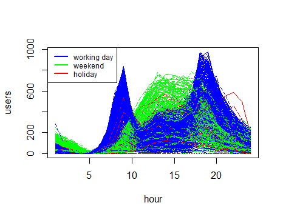
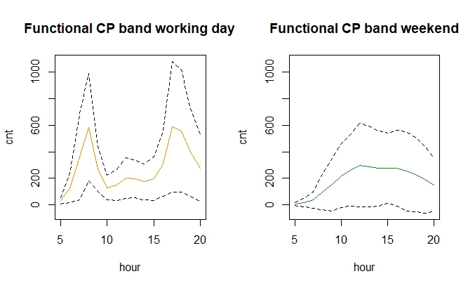

# Bike-Sharing Systems: Usage Patterns and Maintenance Scheduling

Nonparametric Statistics project, Politecnico di Milano (Mathematical Engineering), A.Y. 2024-2025.

**Authors:** Marco Luigi Deviardi, M. Dello Russo, G. Gorbani

## Overview

Analysis of two years of Capital Bikeshare rental data (Washington D.C.) to find the best hours and days for routine bike maintenance with minimal impact on bike availability. The project combines permutation tests, functional data analysis, conformal prediction and semiparametric GAMs. Conformal prediction bands suggest maintenance windows of 10 AM - 3 PM on working days and 5 - 10 AM on weekends.




## Dataset

Daily and hourly rentals from 2011 and 2012, split into casual and registered users, together with calendar variables (working day, weekend, holiday) and weather variables (temperature, feeling temperature, humidity, wind speed, weather situation).

## My contribution

Within the group I mainly worked on the **exploratory analysis** and on the **conformal prediction** part of the project.

## How to run

Install the R packages loaded at the top of `Bike_def.Rmd` and knit it.

## Repository structure

```
├── Bike_def.Rmd    Full analysis (R Markdown)
├── data            Dataset files 
├── output          Figures
└── README.md
```
